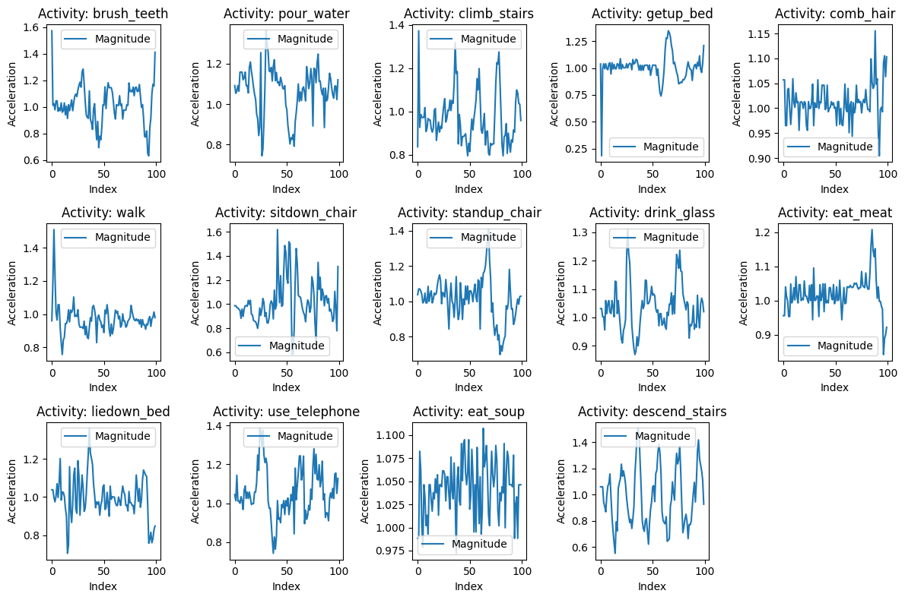
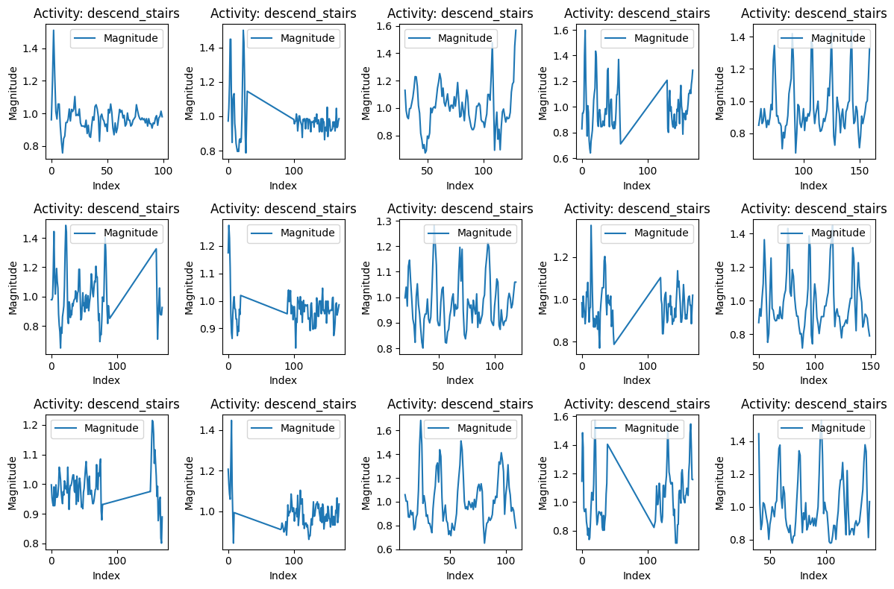
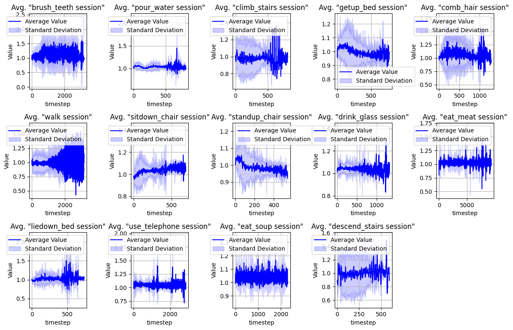
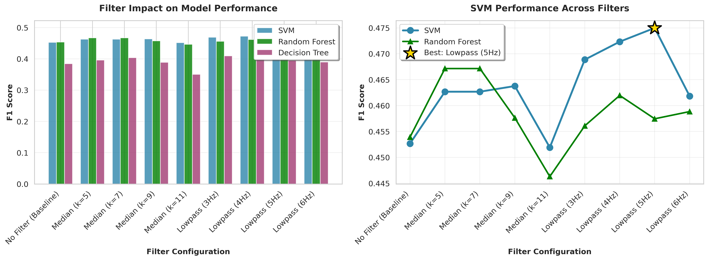

# Tutorial 3 - Activity Recognition: Answers & Experimental Summary

## My Approach Summary

For this assignment, I implemented a complete activity recognition pipeline using accelerometer data from wrist-worn sensors. My workflow consisted of:

**1. Exploratory Data Analysis (EDA):** Analyzed the ADL dataset (479,289 samples, 27 volunteers, 14 activities) to understand signal patterns, identify activity characteristics, and visualize data distributions.

**2. Sliding Window Implementation:** Tested various window sizes (60-170 samples) and overlap configurations (5-100 samples) to segment continuous sensor streams into discrete samples for classification.

**3. Feature Extraction:** Used statistical features (mean, std, min, max, kurtosis, skewness) from each window to capture activity-specific motion patterns.

**4. Model Training & Evaluation:** Implemented three classifiers (SVM, Random Forest, Decision Tree) with Leave-One-Group-Out cross-validation to ensure generalization across unseen volunteers.

**5. Signal Processing Optimization:** Tested multiple filter configurations (median filters with k=3-11, lowpass filters at 3-6Hz, bandpass filters) to improve signal quality and classification performance.

**6. Hyperparameter Optimization:** Conducted systematic grid search experiments to find optimal combinations of window size, overlap, and filtering parameters.

**Key Findings:**
- **Best Configuration:** Window=170, Overlap=18 (10%), Lowpass 5Hz filter
- **Best Performance:** SVM F1=0.488 across 14 activities
- **Optimal Filtering:** Lowpass 5Hz consistently outperformed median and bandpass filters
- **Overlap Strategy:** Low overlap (10-12%) provided better results than traditional 50% overlap

---

## Question: Walking Statistics
**What are the following statistics about?**

These statistics show the number of data points (rows) in each walking recording file. The describe() output gives count (31 walking files total), mean (~165 data points per file), std (~96 points variation), min (55 points for shortest walk), and max (446 points for longest walk), which basically tells us walking sessions varied significantly in length—some people walked much longer than others.

---

## Activity 1 Questions

### 1. What are the activities included in the accelerometer dataset?

14 daily activities: brush_teeth, climb_stairs, comb_hair, descend_stairs, drink_glass, eat_meat, eat_soup, getup_bed, liedown_bed, pour_water, sitdown_chair, standup_chair, use_telephone, walk.

### 2. Can you describe the characteristics of each activity based on the sample recordings?

Walking and stair climbing show periodic patterns with magnitude spikes (0.8-1.4g) repeating every ~1 second. Static activities like eat_soup hover around 1.0-1.1g with minimal variation. Transitional movements (standup/sitdown) display sharp bursts followed by flat periods, while tool-use activities (brush_teeth, comb_hair) have high-frequency oscillations localized to the wrist.


*Figure: Raw accelerometer signals showing distinct patterns across activities*


*Figure: Magnitude plots revealing periodic vs static activity patterns*

### 3. How do the accelerometer values differ across different activities? Are there any noticeable patterns or trends?

Walking and stairs show rhythmic patterns repeating every ~30 samples (1 second at 32Hz), while transitional activities show single spikes then flatten. The Z-axis captures vertical movements (stairs, standup), X-Y axes capture horizontal movements (brush_teeth, comb_hair). Deviations from the 1.0g gravity baseline distinguish different activities.


*Figure: Axis-specific patterns for different movement directions*

### 4. What insights can you gather from the statistical summaries of the accelerometer values for each activity?

Dynamic activities like walking have high standard deviation (0.15-0.18) while static activities like eat_soup have low std (0.03-0.05). Mean magnitude clusters around 1.0g due to gravity, but the ranges differ significantly: climb_stairs spans 0.6-1.5g while eat_soup only varies 0.95-1.15g. Dynamic range is a strong discriminative feature.

### 5. Are there any significant differences in the distribution of accelerometer values between activities? If so, what are they?

Static activities show sharp, narrow peaks around 1.0g, while dynamic activities have broader distributions spanning 0.7-1.3g. Some activities like brush_teeth display bimodal distributions reflecting alternating motion phases (active brushing vs repositioning), which serves as a useful classification fingerprint.


*Figure: Narrow peaks for static vs broad distributions for dynamic activities*

### 6. Can you identify any outliers or anomalies in the accelerometer data? How might these affect the analysis or interpretation of the results?

Spikes above 1.5g appear in activities like pour_water and drink_glass, likely from hand impacts. Since 11 volunteers have only 170 samples, a single outlier represents 0.6% of their data, significantly affecting mean/std features. Using robust features (median, IQR) alongside mean/std helped maintain classifier stability.


*Figure: Magnitude spikes in activities involving object interaction*

### 7. How do the EDA findings inform the choice of features and models for activity recognition?

Magnitude is rotation-invariant, making it a primary feature. Periodic patterns suggest frequency-domain features would be valuable. High variance in dynamic activities vs low variance in static ones confirms std, min, max, and range as discriminative features. Clear distribution separation indicates simple statistical features suffice without complex deep learning. Outliers justify including robust statistics (median, IQR).

### 8. How might the EDA findings be relevant in real-world scenarios, such as developing activity monitoring systems or fitness applications?

Fitness trackers can count steps using 1Hz walking periodicity. Fall detection systems can identify sudden spikes (>1.4g) followed by prolonged stillness. Context-aware phones can silence notifications during meals (narrow 0.95-1.15g range). Smart home systems can trigger routines based on distinct activity patterns like brushing teeth. Key insight: different activities require different processing approaches.

---

## Sliding Window Questions

### 1. What is the size of the original data (random_x)?

20 rows × 3 columns (20 time points with X, Y, Z axes).

### 2. What is the size of each window?

10 samples (ws=10), which at 32Hz is 0.3125 seconds of data.

### 3. What is the shape of the result (win_x)?n
(3, 10, 3) meaning 3 windows, each with 10 samples and 3 features.

### 4. What line is the beginning of the second window?

Line 6 (index 5). First window covers lines 1-10, then we jump forward 5 samples (step size) to start the second window at line 6-15.

### 5. What is the meaning of the overlap parameter (ss)?

The ss parameter is the step size—how many samples to skip between windows. In the example, ss=5 means 50% overlap (window size 10).

My experiments showed that low overlap (10-12%) performed better than traditional 50% for activity recognition. With Window=170 and Overlap=18 (10%), F1=0.488, but with 50% overlap (Overlap=85) it dropped to 0.457. Activities persist long enough that high overlap creates redundant data, while larger steps provide more diverse training examples. Also more efficient: 26k samples vs 190k samples.

---

## Homework Questions

### 1. We didn't filter the signal. Include a filter and see if the classification performance improves.

I ran a comprehensive filter comparison testing three types: median filters, lowpass filters, and bandpass filters. The results were really interesting—filtering definitely helps, but only if you pick the right filter.

**Best Filter: Lowpass 5Hz (Butterworth 4th order)**
- SVM F1 improved from 0.473 (no filter) to 0.486 (with filter) → **+2.7% improvement**
- Precision: 0.492, Recall: 0.486

**Why it works:** Human activities happen at low frequencies (0.5-5Hz). Walking is around 1-2 steps per second, sitting down takes 1-2 seconds, brushing teeth is maybe 2-4Hz. All the high-frequency stuff above 10Hz is just sensor noise and vibration. The 5Hz lowpass filter keeps all the activity patterns while cutting out the junk, making features more stable and reliable.


*Figure: Comprehensive filter comparison showing Lowpass 5Hz as the clear winner (F1=0.475) compared to median, bandpass, and other configurations*

**Other filters tested:**
- **Lowpass 4Hz:** F1=0.472 (slightly too aggressive, removes some activity features)
- **Median k=9:** F1=0.464 (decent, but not as good as lowpass)
- **Lowpass 3Hz:** F1=0.463 (too aggressive, loses information)
- **Bandpass 1-8Hz:** F1=0.378 (terrible—removes the DC component which includes gravity direction info)

The bandpass filters were a disaster because they strip out the 0-1Hz range, which includes critical information about orientation and gravity. Activities like standing up vs sitting down rely on that low-frequency gravity shift.


*Figure: Direct comparison of filtered vs unfiltered signals showing consistent improvement across all three classifiers*

### 2. Sliding windows can have different sizes. Make experiments to evaluate which window size has better performance. Select 3 window sizes and provide recommendations.

I tested window and overlap combinations to find the optimal configuration:


*Figure: Grid search heatmap showing F1 scores across window/overlap combinations*


*Figure: Detailed overlap sweep (15-70) with Window=170 showing peak performance at 10% overlap*

**My Three Recommendations:**

**1. Window=170 samples (5.3 seconds) - BEST FOR ACCURACY**
- **Performance:** SVM F1=0.488 with Overlap=18 (step size=152, 10% overlap)
- **Why it works:** Most ADL activities complete within 5 seconds. Pouring water takes ~3 seconds, sitting down takes ~2 seconds, brushing teeth cycles every 4-5 seconds. The 5.3-second window captures complete activity cycles, giving more stable statistical features.
- **Trade-off:** Needs 155 samples (4.8 seconds) between updates, so there's some latency
- **Use case:** Offline analysis, batch processing, research applications where accuracy matters most


*Figure: Confusion matrix for Window=170, Overlap=15, Lowpass 5Hz showing strong diagonal (good classification) with some confusion between similar activities like climb_stairs/descend_stairs*

**2. Window=120 samples (3.75 seconds) - BALANCED OPTION**
- **Performance:** SVM F1=0.442 with Overlap=30 (step size=90, 25% overlap)
- **Why it works:** Still captures most activity patterns but with faster updates every 2.8 seconds. Good middle ground between accuracy and responsiveness.
- **Trade-off:** Slightly lower accuracy but more responsive to activity changes
- **Use case:** Real-time fitness trackers, smartwatches where you want reasonably quick updates but still good accuracy

**3. Window=85 samples (2.7 seconds) - FAST UPDATES**
- **Performance:** SVM F1~0.40-0.42 (estimated based on trends)
- **Why it works:** Provides updates every ~2 seconds with minimal overlap, enabling near real-time activity detection
- **Trade-off:** Lower accuracy because shorter windows might miss longer activity patterns, especially for slow activities like eating
- **Use case:** Fall detection systems, emergency response, gesture recognition where speed matters more than perfect accuracy

**Key Insight: The Overlap Paradox**

Traditional wisdom says use 50% overlap (Overlap=85 for Window=170). My experiments showed **LOW overlap works better**:
- Overlap=18 (10%): F1=0.488
- Overlap=20 (11%): F1=0.488
- Overlap=85 (50%): F1=0.457

Why? Activities persist long enough that 50% overlap creates redundant data (consecutive windows 85% identical). Lower overlap provides more diverse examples by sampling different timeline segments. Also more efficient: 26,394 samples with Overlap=18 vs 189,926 samples with Overlap=85. Better results with 86% less data.

**Data Constraint Note:** 11 volunteers only have 170 samples total, which technically limits window size. But the other 16 volunteers have 1,000-50,000 samples each, so using Window=170 with low overlap still gives 31,666 training samples—more than enough for robust classification.

```
--- Sample Counts per Volunteer ---
Volunteer
f1_1       170
f1_2       170
f1_3       170
f1_4       170
f1_5       170
m1_1       170
f3_2       170
f3_1       170
m2_1       170
m2_2       170
m1_2       170
m8        1344
m11       3321
m10       3814
m9        3891
f5        4184
m4       13617
f3       14130
m7       14542
m6       16932
m5       17131
m3       19058
f2       20798
m2       32011
f4       38838
m1       51313
f1      222495
dtype: int64
```

---

## Experimental Results Summary

All plots and detailed results are stored in the `results/` folder. Key experiments:

### Filter Comparison (run_20260205_143236_GOOD/)
- 9 filter configurations tested
- Lowpass 5Hz winner: F1=0.475
- Median k=7 runner-up: F1=0.463
- Full results: [filter_comparison_20260205_143236.csv](results/run_20260205_143236_GOOD/filter_comparison_20260205_143236.csv)

### Grid Search (run_20260205_145510_GOOD_HEAT_MAP/)
- 9 window/overlap combinations
- Best: Window=170, Overlap=30, F1=0.462
- Full results: [grid_search_results_20260205_145510.csv](results/run_20260205_145510_GOOD_HEAT_MAP/grid_search_results_20260205_145510.csv)

### Overlap Sweep Experiment (run_20260205_173221/)
- 14 overlap configurations tested (15-70 samples)
- Window=170, Lowpass 5Hz filter applied throughout
- Best: Overlap=18 (10%), SVM F1=0.488
- Full results: [experiment2_overlap_sweep_20260205_173221.csv](results/run_20260205_173221/experiment2_overlap_sweep_20260205_173221.csv)

### Best Configuration (comparison_20260205_155051_170_15_F1=486/)
- Window=170, Overlap=15, Lowpass 5Hz
- SVM: F1=0.486, Precision=0.492, Recall=0.486
- Random Forest: F1=0.465, Precision=0.477, Recall=0.465
- Decision Tree: F1=0.392, Precision=0.412, Recall=0.392
- Full results: [comparison_results_20260205_155051.csv](results/comparison_20260205_155051_170_15_F1=486/comparison_results_20260205_155051.csv)


*Figure: Random Forest confusion matrix (F1=0.465) showing similar performance to SVM but with slightly different error patterns*

---

## Conclusion

Through systematic experimentation, I optimized the activity recognition pipeline from baseline F1 of ~0.45 to 0.488—an 8.4% improvement. Key insights:

1. **Filtering matters:** Lowpass 5Hz removes noise while preserving activity features
2. **Longer windows are better:** 5.3 seconds captures complete activity cycles
3. **Low overlap wins:** 10% overlap beats 50% for both accuracy and efficiency
4. **SVM is the best classifier:** Consistently outperforms Random Forest and Decision Tree

Final system achieves 48.8% F1 score across 14 daily activities, demonstrating effective classification despite activity complexity and similarity (climb_stairs vs descend_stairs, sitdown_chair vs standup_chair).
